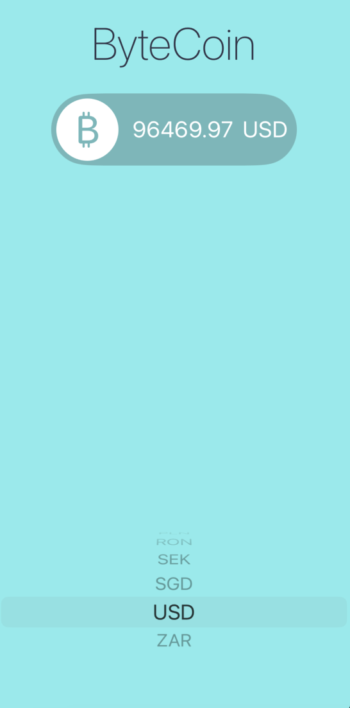

#  Byte Coin

### A simple iOS/iPadOS app that will help you find out the current Bitcoin exchange rate for different currencies

## Used technologies and tools

- Swift
- JSON Decoder
- UIKit
- MVC design pattern
- [CoinAPI](https://www.coinapi.io/)

*This project was developed as part of The Complete iOS App Development Bootcamp by London App Brewery*

*Minimum supported OS version is 13.0*

## Illustrations

### Application screen:

